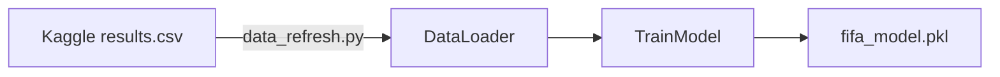
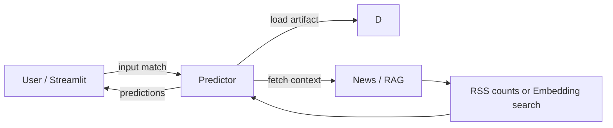
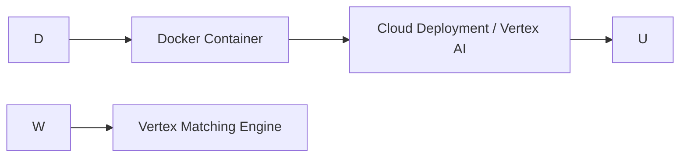

**Architecture**

This document describes the system architecture and dataflow for the ML_FIFA project. It includes both the quick prototype (RSS-based RAG) and a production RAG option (embeddings + Vertex Matching Engine).

**High-level components**
- Data Source: Kaggle `martj42/international-football-results` (`results.csv`)
- Data Refresh: `data_refresh.py` (Kaggle API)
- Feature engineering: `DataLoader.py` (history, head-to-head, team strength)
- Model training: `TrainModel.py` (Random Forest)
- RAG enrichment (prototype): `rag_enrich.py` (Google News RSS, keyword counts)
- RAG production scaffold: `rag_production.py` (sentence-transformers embeddings, local index, Vertex Matching Engine upload)
- Model serving: `Predictor.py` (adds live RAG features at inference), `vertex_deploy.py` (Vertex AI helper)
- UI: `app.py` (Streamlit)

Data Flow Diagrams

### Training and Model Preparation

### Inference and Prediction Flow

### Production Deployment Flow

Deployment Options
- Local: Streamlit UI + local model artifact `fifa_model.pkl`
- Cloud: upload artifact to GCS and deploy on Vertex AI using `vertex_deploy.py`, optionally use Vertex Matching Engine for RAG index

Component Notes
- `DataLoader.py`: constructs temporal features by iterating matches in chronological order (no leakage). RAG columns are zero-filled during training so model shape stays consistent.
- `rag_enrich.py`: cheap, fast, no-auth prototype using Google News RSS; counts injury-related keywords.
- `rag_production.py`: builds embeddings and writes an index (jsonl) containing embeddings for each article; index can be uploaded to GCS and registered with Vertex Matching Engine.

Security and Costs
- Vertex AI and Matching Engine incur cloud costs; use GCP free credits for experimentation (Google Cloud Free Trial).
- Keep `kaggle.json` private and do not commit secrets.

Monitoring & Retraining
- Recommended schedule: weekly data refresh + retrain.
- Save model artifacts with timestamped names for traceability.

